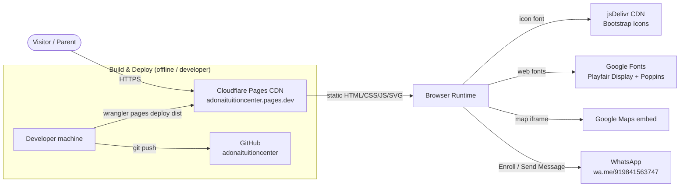
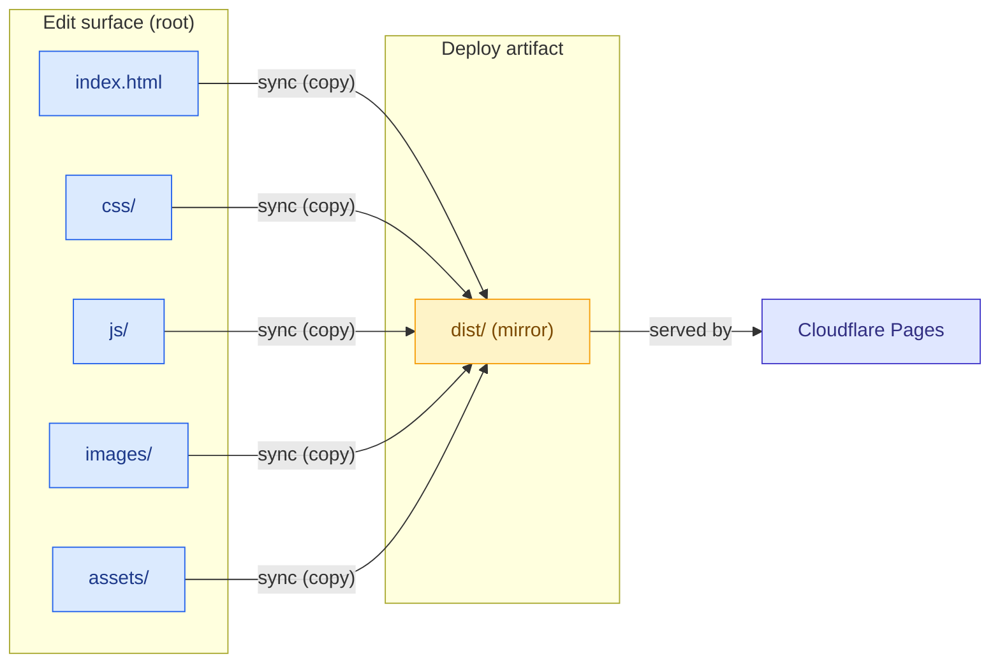
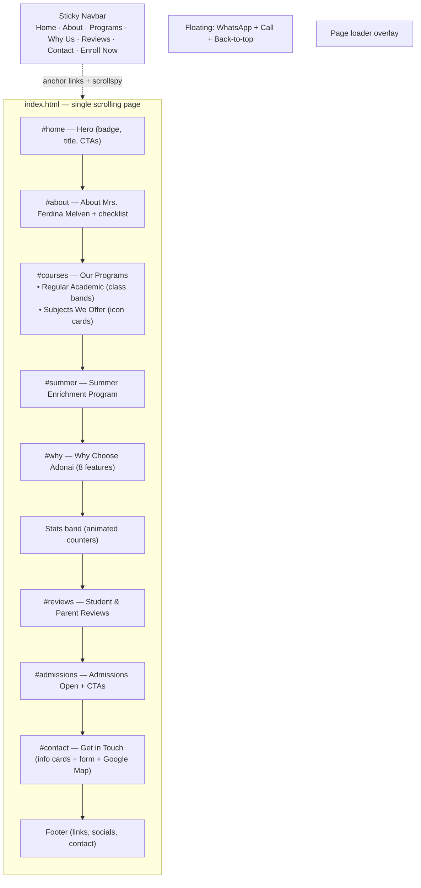
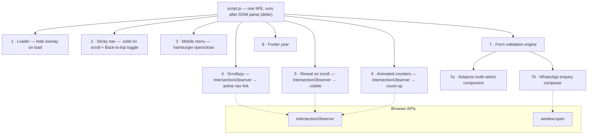
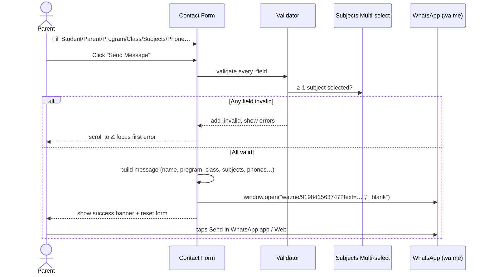
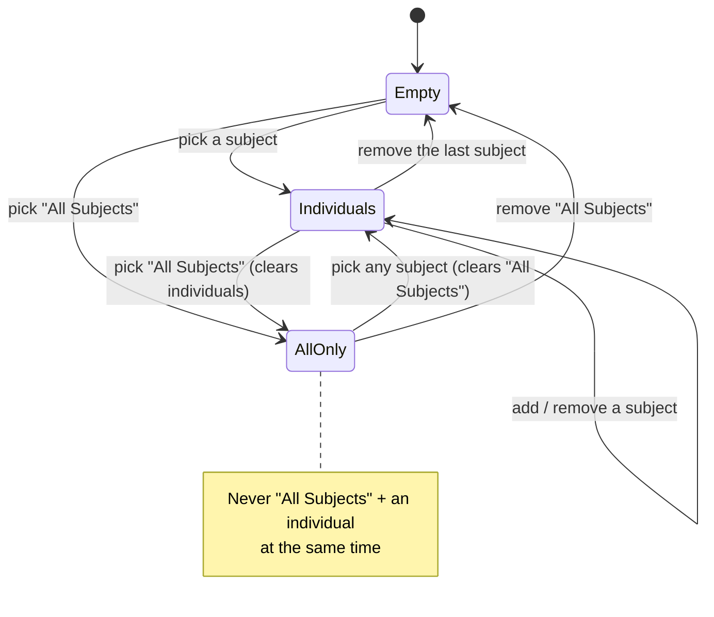
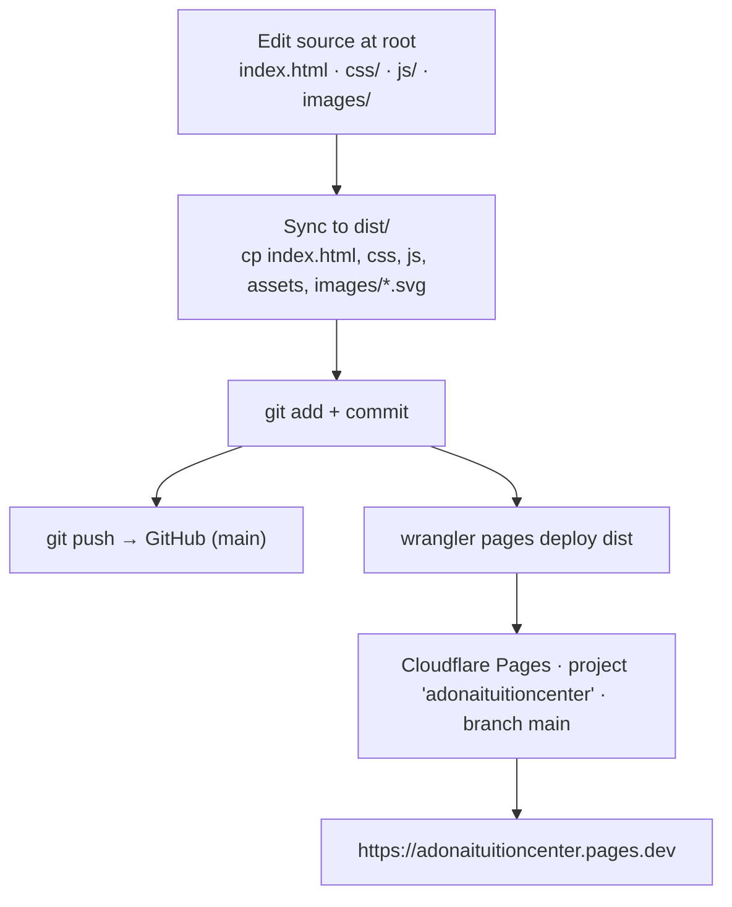
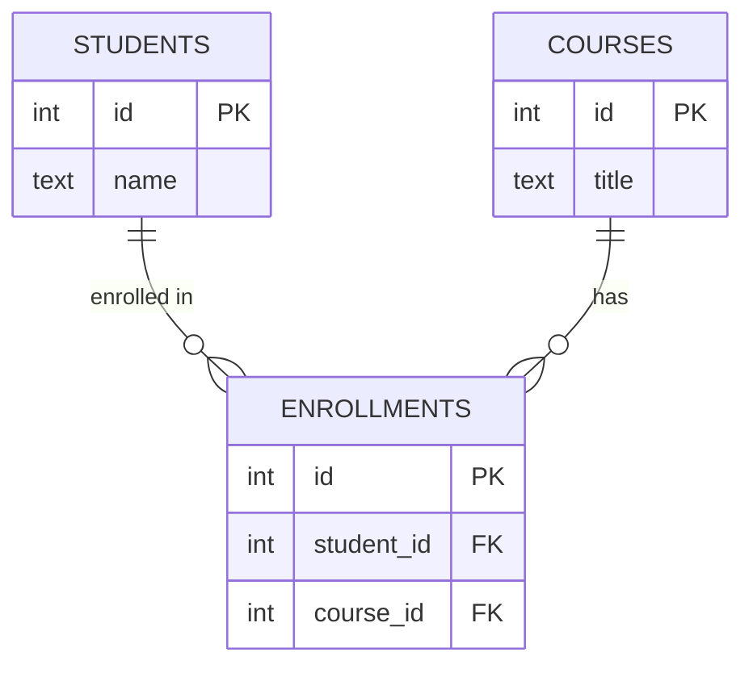

# Adonai Tuition Center — Project Architecture & Design

**Live site:** https://adonaituitioncenter.pages.dev
**Repository:** https://github.com/maliniwilson73-max/adonaituitioncenter
**Last reviewed:** 2026-07-18

---

## 1. Overview

The project delivers the public marketing website for **Adonai Tuition Center**, a tuition
centre in Besant Nagar, Chennai (Classes 1–10, all subjects except Hindi, run by
**Mrs. Ferdina Melven**, 25+ years' experience).

It is a **single-page, fully static website** — HTML5 + CSS3 + vanilla JavaScript, with
**no build step and no application server**. It is hosted for free on **Cloudflare Pages**
and hands enquiries off to **WhatsApp**.

The repository also contains a **separate, legacy Flask application** (student / course /
enrollment admin) that is **not part of the deployed website**. It is documented in
§9 for completeness but is independent of the live site.

### Design goals

| Goal | How it's met |
|------|--------------|
| Zero hosting cost | Cloudflare Pages free tier + `*.pages.dev` URL |
| No backend to maintain | Static files only; enquiries routed to WhatsApp |
| Fast & lightweight | ~1,100 lines total; SVG assets; only icon-font + web-font CDNs |
| Premium, on-brand look | Blue theme, serif display headings, glassmorphic accents |
| Fully responsive & accessible | Mobile-first CSS, ARIA roles, keyboard support |
| Easy to edit | Plain HTML/CSS/JS, heavily commented, single page |

---

## 2. High-Level Architecture

The runtime is a classic **static-site + third-party-services** model. The browser loads
the page from Cloudflare's CDN and talks directly to a few external services (fonts,
icons, map, WhatsApp). There is **no origin server** in the request path.



**Key characteristics**

- **Stateless & serverless** for the marketing site — every visitor gets the same static files.
- **No first-party data collection** — the contact form composes a WhatsApp message on the
  client; nothing is stored or POSTed to a server.
- **Progressive**: the page renders and is usable even if JavaScript is disabled (JS only
  adds interactivity/animation; content is in the HTML).

---

## 3. Technology Stack

| Layer | Technology | Notes |
|-------|-----------|-------|
| Markup | HTML5, single document (`index.html`) | Semantic sections, SEO meta, JSON-LD |
| Styling | CSS3 (hand-written) | Custom design tokens; **no CSS framework** |
| Icons | Bootstrap Icons 1.11.3 (CDN) + inline SVG | Custom SVGs for Math/Science/Globe subject icons |
| Fonts | Google Fonts — Playfair Display (serif headings), Poppins (body) | |
| Behaviour | Vanilla JavaScript (ES6, single IIFE) | **No framework, no bundler, no npm runtime deps** |
| Hosting | Cloudflare Pages (static) | Free `*.pages.dev` domain |
| Source control | Git + GitHub | Two remotes (see §8) |
| Deploy tool | Wrangler CLI 4.111.0 | Direct-upload of `dist/` |
| Legacy admin (separate) | Python 3, Flask, SQLite | Not deployed — see §9 |

---

## 4. Repository Structure

```
Tuition-Center-App/
│
├── index.html                     # ← THE website (single page)
├── css/
│   ├── style.css                  # design tokens + all component styles
│   └── responsive.css             # grid helpers + media queries
├── js/
│   └── script.js                  # all interactivity (one IIFE)
├── images/                        # SVG assets (logo, hero, teachers, gallery, subjects)
├── assets/
│   └── og-image.svg               # social share image
├── fonts/                         # (reserved; web fonts loaded from Google)
│
├── dist/                          # ★ DEPLOY ARTIFACT — mirror of the site, served by Cloudflare
│   ├── index.html
│   ├── css/  js/  images/  assets/
│
├── wrangler.toml                  # Cloudflare Pages config (pages_build_output_dir = ./dist)
├── Project Architecture and Design.md
│
├── ── Legacy / unrelated to the live site ──
├── app.py                         # Flask admin app (NOT deployed)
├── templates/                     # Jinja templates for the Flask app
├── static/                        # Flask app assets
├── db.sqlite3                     # Flask app database
├── requirements.txt               # Python deps (Flask, gunicorn)
├── docs/                          # misc
└── .gitignore                     # ignores *.zip and local photo dumps
```

> **Editing model:** the **repository root is the source of truth**. `dist/` is a **build
> artifact** that must be re-synced from the root before every deploy (see §8). Cloudflare
> serves **only** `dist/`.



---

## 5. Frontend Architecture

### 5.1 Page section map

`index.html` is one scrolling page. A fixed navbar links to in-page anchors; a scrollspy
highlights the active section.



### 5.2 Design system (tokens)

All visual constants live as CSS custom properties in `:root` (`css/style.css`).

| Token group | Values |
|-------------|--------|
| **Blues** | `--blue #2563EB`, `--blue-dark #1E40AF`, `--blue-bright #3B82F6`, `--navy #1E3A8A`, `--navy-deep #0F172A` |
| **Neutrals** | `--ink #1F2937`, `--muted #6B7280`, `--bg #FFFFFF`, `--bg-alt #F3F4F6`, `--bg-soft #F8FAFC`, `--line #E5E7EB` |
| **Accents** | `--green #22C55E` (form/admission ticks); warm amber only for the Summer & hero-badge icons |
| **Gradients** | `--grad-blue`, `--grad-hero` |
| **Typography** | `--font-serif` Playfair Display (headings), `--font-sans` Poppins (body/UI) |
| **Shape/anim** | `--radius 18px`, `--radius-sm 10px`, shadows `--shadow-sm/md/lg`, `--ease` cubic-bezier |
| **Layout** | `--container 1180px` (1260 ≥1400px), `--nav-h 76px` |

> The palette is deliberately **blue + white + light-grey with green ticks** — no gold — to
> match the reference design.

### 5.3 CSS architecture

```
css/style.css        (≈336 lines)
  1. Design tokens (:root)
  2. Base / reset            13. Reviews
  3. Section heading         14. Admissions
  4. Buttons                 15. Contact (form, info cards, multi-select)
  5. Navbar                  16. Footer
  6. Hero                    17. WhatsApp / Call floats
  7. About founder           18. Loader
  8. Course programs         19. Reveal animation + keyframes
  9. Programs intro / labels
 10. Subjects we offer
 11. Summer course
 12. Stats band

css/responsive.css   (≈71 lines)
  - Grid helpers: .grid-2 / .grid-3 / .grid-4 / .grid-5, .about-grid, .footer-grid
  - Breakpoints: ≥1400 (wide), ≤992 (tablet → hamburger), ≤768 (large phone),
    ≤576 (phone), plus component-specific tweaks (hero heading, contact cards)
```

**Responsive strategy** — mobile-first grids that collapse by breakpoint:

| Component | Desktop | Tablet (≤992) | Phone (≤576) |
|-----------|---------|---------------|--------------|
| Nav | inline links | hamburger drawer | hamburger drawer |
| Course/Review cards (`grid-3`) | 3 col | (2/3) | 1 col |
| Feature/Stats (`grid-4`) | 4 col | 2 col | 1 col |
| Subject cards / info cards (`grid-5`) | 5 col | 2 col | 1 col |
| Hero heading | 1 line | 2 lines | 3 lines (font-driven, non-breaking phrases) |

Horizontal overflow is guarded globally with `overflow-x: clip` on `html, body`.

### 5.4 JavaScript architecture

`js/script.js` is a **single IIFE** (`(function(){ 'use strict'; … })()`), loaded with
`defer`. It is organised into independent, guard-checked modules — each feature no-ops
gracefully if its DOM hooks are absent.



| # | Module | Responsibility |
|---|--------|----------------|
| 1 | Loader | Hides the full-screen loader shortly after `window.load` |
| 2 | Sticky nav | Adds `.solid` past 60px scroll; shows Back-to-top past 500px |
| 3 | Mobile menu | Toggles the hamburger drawer; closes on link click |
| 4 | Scrollspy | `IntersectionObserver` on `section[id]` → sets `.active` nav link |
| 5 | Reveal | `IntersectionObserver` adds `.visible` to `.reveal` elements (fade-up) |
| 6 | Counters | `IntersectionObserver` triggers eased count-up on `[data-count]` |
| 7 | Form engine | Per-field validation (`required/email/phone/name`), optional-field skip, submit handling |
| 7a | Multi-select | Chips + dropdown + exclusive "All Subjects" logic (see §6.2) |
| 7b | WhatsApp composer | Builds the enquiry text and opens `wa.me` (see §6.1) |
| 8 | Footer year | Injects current year into `[data-year]` |

### 5.5 Accessibility

- Semantic landmarks (`<header>`, `<main>`, `<section>`, `<footer>`), one `<h1>`.
- Nav is keyboard-navigable; hamburger button exposes `aria-expanded`.
- The Subjects control uses `role="combobox"` + `role="listbox"` / `role="option"` with
  `aria-multiselectable`, `aria-expanded`, `aria-selected`, arrow-key navigation and Esc.
- Form fields use associated `<label>`s and inline error messages; the first invalid field
  is focused/scrolled to on submit.
- Decorative SVG/icon elements are `aria-hidden`; images have `alt` text.
- `prefers-reduced-motion` disables non-essential animation.

### 5.6 SEO & metadata

- `<title>`, meta description/keywords, Open Graph tags, `og-image.svg`.
- **JSON-LD** `EducationalOrganization` structured data (name, founder, telephone, address).
- Favicon (SVG). Human-readable content is all in the HTML (crawlable without JS).

---

## 6. Key Interaction Flows

### 6.1 Contact form → WhatsApp

The "Send Message" form does **not** POST anywhere. On a valid submit it composes a
formatted enquiry and opens a pre-filled WhatsApp chat to **+91 98415 63747**.



**Example composed message**

```
*New Enquiry - Adonai Tuition Center*
Student: Arjun Kumar
Parent/Guardian: Priya Kumar
Program: Regular Academic Program
Class: Class 8
Subjects: English, Science          (or "All Subjects")
School: -
Student Phone: -
Parent Phone: 9876543210
```

### 6.2 Subjects multi-select — "All Subjects" is exclusive

A custom dropdown renders selected subjects as removable chips. **"All Subjects" and the
individual subjects are mutually exclusive.**



Validation requires at least one selection (`Empty` state fails). The dropdown stays open
while selecting and closes on outside-click / Esc.

### 6.3 Navigation, scroll & animation

- **Scrollspy** and **smooth scrolling** keep the active section in sync with the URL hash
  and highlight the nav link.
- **Reveal-on-scroll** and **animated counters** are driven by `IntersectionObserver` and
  fire once as sections enter the viewport.
- The Summer Enrichment section remains in the page (under "Programs") even though its
  dedicated nav link was removed.

---

## 7. Data & Content

- **No dynamic data / database** for the marketing site. All content (courses, reviews,
  stats, contact details) is authored directly in `index.html`.
- **Real business data** baked in: Director **Ferdina Melven** (25+ yrs), phone
  **+91 98415 63747** (used for `tel:`, `wa.me`, and the enquiry), address *33rd Cross St,
  Tiruvalluvar Nagar, Besant Nagar, Chennai 600090*; classes **1–10**, **all subjects
  except Hindi**; hours **Mon–Sat 4:30–7:30 PM**.
- **Reviews** are the centre's real Google reviews (Devina Anto, Shalom Tuition Centre,
  Beatrice Asha).
- **Imagery** is self-contained SVG (logo, hero illustration, teacher/gallery placeholders,
  subject icons) — no external image hosting, keeping the site fast and offline-safe.

---

## 8. Build & Deployment

There is **no build/bundling step**. "Building" = copying the edited root files into
`dist/`. Deployment is a **direct upload** of `dist/` to Cloudflare Pages (not Git-connected),
plus a `git push` for source history.



### 8.1 Sync + deploy commands

```bash
# 1) Mirror the edited source into the deploy artifact (only ship SVGs from images/)
rm -rf dist/* && cp index.html dist/ && cp -r css js assets dist/ \
  && mkdir -p dist/images && cp images/*.svg dist/images/

# 2) Commit + push source history
git add -A && git commit -m "…" && git push

# 3) Publish to Cloudflare Pages (see environment note below)
NODE_OPTIONS=--use-system-ca npx wrangler@4.111.0 pages deploy dist \
  --project-name=adonaituitioncenter --branch=main --commit-dirty=true
```

### 8.2 Environment notes (important)

- **`NODE_OPTIONS=--use-system-ca` is required.** Norton's HTTPS scanning re-signs TLS with
  a certificate Node's bundled CA store rejects (`UNABLE_TO_VERIFY_LEAF_SIGNATURE` /
  "fetch failed"). `--use-system-ca` makes Node trust the Windows store (which Norton
  installed into). Git and browsers already trust it, so only Wrangler needs the flag.
- **Wrangler is pinned to `4.111.0`** (the cached version) to avoid `npx` trying to fetch a
  newer, uncached release.
- **Deploy is direct-upload, not Git-connected** — pushing to GitHub does **not** auto-deploy;
  run the `wrangler pages deploy` step to publish. (Connecting the repo in the Cloudflare
  dashboard would enable auto-deploy if desired.)
- **Cloudflare account:** `ferdinaprojects@gmail.com`. **Production branch:** `main`.

### 8.3 Git remotes

| Remote | URL | Role |
|--------|-----|------|
| `adonaituitioncenter` | github.com/maliniwilson73-max/**adonaituitioncenter** | Primary / tracked by `main`; matches the Pages project |
| `origin` | github.com/maliniwilson73-max/**Tuition-Center-App** | Secondary (not the deploy source) |

### 8.4 Cloudflare config (`wrangler.toml`)

```toml
name = "adonaituitioncenter"
compatibility_date = "2026-07-16"
pages_build_output_dir = "./dist"
```

---

## 9. Legacy Flask Admin App (separate, not deployed)

The repo root also holds an older **Flask + SQLite** admin app for managing students,
courses and enrollments. It is **independent of the live marketing site**, runs locally,
and is **not** served by Cloudflare.

- Entry point: `app.py` (routes below) · templates in `templates/` (Jinja, `layout.html`
  base) · styles in `static/style.css` · data in `db.sqlite3`.
- Run: `pip install -r requirements.txt` then `python app.py` → http://127.0.0.1:5000

**Routes**

| Method | Path | Purpose |
|--------|------|---------|
| GET | `/` | Dashboard |
| GET | `/students` · `/courses` · `/enrollments` | List views |
| GET/POST | `/students/add` · `/courses/add` | Create forms |
| POST | `/enrollments/add` | Link student ↔ course |
| POST | `/…/<id>/delete` | Delete student / enrollment |

**Data model** (SQLite, inferred from routes — illustrative)



> **Recommendation:** keep this app in a separate folder or repository to avoid confusing it
> with the deployed static site. It is excluded from `dist/` and never shipped.

---

## 10. Cross-Cutting Concerns

### Security & privacy
- No secrets, API keys, or credentials in the client (the site is fully public/static).
- No first-party data storage — enquiries go straight to WhatsApp on the parent's device.
- Third-party embeds: Google Maps (iframe, `referrerpolicy` set), Google Fonts, jsDelivr.
- External links use `rel="noopener"`.

### Performance
- Tiny footprint (~1,100 lines of source; SVG imagery).
- Fonts `display=swap`; scripts `defer`; images lazily revealed.
- Served from Cloudflare's global CDN with HTTP/2 + edge caching.

### Reliability / offline-safety
- All imagery is inline SVG in-repo (no broken external images).
- Only runtime external dependencies are the **icon font**, **web fonts**, the **map iframe**,
  and the **WhatsApp handoff** — none block core content rendering.

---

## 11. Future Enhancements (optional)

- Connect the GitHub repo to Cloudflare Pages for **auto-deploy on push** (removes the manual
  `wrangler` step).
- Add a real backend or form service (e.g., Cloudflare Pages Functions / Formspree) if
  server-side capture of enquiries is ever needed.
- Replace placeholder teacher/gallery SVGs with the centre's real photos
  (`images/adonaituitioncenterpictures/` is currently git-ignored).
- Add a custom domain in Cloudflare Pages if one is purchased later.
- Move the legacy Flask app out of this repo.

---

## 12. Quick Reference

| Item | Value |
|------|-------|
| Live URL | https://adonaituitioncenter.pages.dev |
| Repo (primary) | github.com/maliniwilson73-max/adonaituitioncenter |
| Cloudflare project | `adonaituitioncenter` (branch `main`) |
| Contact / WhatsApp | +91 98415 63747 (`wa.me/919841563747`) |
| Director | Mrs. Ferdina Melven |
| Address | 33rd Cross St, Tiruvalluvar Nagar, Besant Nagar, Chennai 600090 |
| Hours | Mon–Sat, 4:30 PM – 7:30 PM |
| Edit surface | repo root (`index.html`, `css/`, `js/`, `images/`) |
| Deploy artifact | `dist/` (mirror; served by Cloudflare) |
| Deploy command | `NODE_OPTIONS=--use-system-ca npx wrangler@4.111.0 pages deploy dist --project-name=adonaituitioncenter --branch=main --commit-dirty=true` |

---

*Document generated as an architecture & design reference for the Adonai Tuition Center
website. Diagrams use Mermaid and render on GitHub and most Markdown viewers.*
